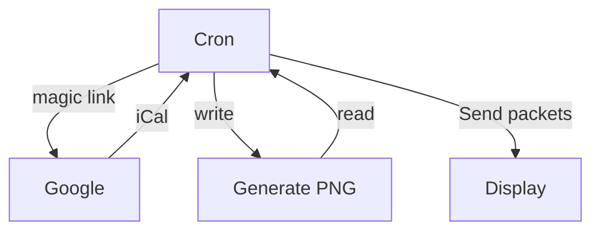

# e-ink-calendar-esp32
E-ink calendar based on ESP32 and Waveshare 1304×984 12.48 inch 3-color display

# Photos

# Design

The most complicated part was to get all the electronic parts together.
The display requires a specific driver board which is only sold by Waveshare and can only be ordered by directly inquiring sales. Then the [wiki page](https://www.waveshare.com/wiki/12.48inch_e-Paper_Module_(B)) incorrectly specifies that the cable is 24-pin. It is not. It is 30-pin. Waveshare sent wrong cables twice. After that I realized that you cannot fit a standard ESP32 dev module into the driver board, because Waveshare made it incompatible (different size and two pins swapped), you must order a special Waveshare braded ESP32 board.

It took 6 months for me to get all the needed parts. If you decide to assemble this project, I recommend you to get a module set which includes everything you need.

After everything gets connected, the data flows as following:

At this point no authentication is implemented. ESP32 would accept any request. You should only run this solution in a trusted LAN.

# Quick start

1. Get `Waveshare 12.48 inch module`: $185 [link](https://www.waveshare.com/12.48inch-e-paper-module-b.htm)
2. Get `Waveshare ESP32 E-Paper driver`: $15 [link](https://www.waveshare.com/e-paper-esp32-driver-board.htm)
3. Install Arduino, add `ESP32 board json`, open project and upload it.
4. Generate `Google Calendar` magic link
5. Edit `.env` file
6. Run `pull_calendar.sh`

# Host program

Host program requires Ubuntu, bash, python3 or docker.

See [cron/](cron/) dir for instructions.

# ESP32 firmware

See [esp32/](esp32/) dir for instructions.
